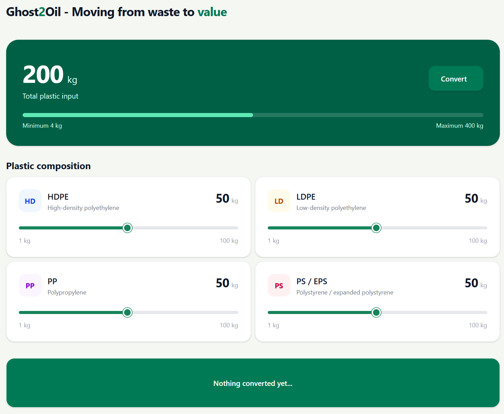

## Ghost2Oil

This project is a demo for our concept for the OceanTech hackathon by UiA Nyskaping - it involves a small web application for converting several types of plastic composites into pyrolysis oil and it's market value (value based from 09/10/26).

This application features [FastAPI](https://fastapi.tiangolo.com/) on the backend in combination with [HTMX](https://htmx.org/) as the frontend, making it a very lightweight application that does not require two separate servers.

## Getting started

The application requires a small number of steps and prerequisites in order to be used:
- [Python 3.14](https://www.python.org/downloads/release/python-3140/)
- [uv](https://docs.astral.sh/uv/)

Please make sure that both are installed prior to running the project.

Running the application itself is really straightforward.

```bash
# Install the necessary dependencies
uv sync

# Change to the /src directory
cd src

# Run the application
fastapi run --host {desired host} --port {desired port}
```

## Usage



Using the application is relatively straightforward. In the middle, there are four sliders indicating different compositions.

You can either slide them to the left to lower the amount or to the right to increase the amount.

After selecting your desired amount of plastic input, you may press the **Convert** button on the upper card which will then convert the amount of plastic input into it's amount in pyrolysis oil and estimated value.

## License

Copyright (c) 2026 Tobias Nguyen. All rights reserved.

No permission is granted to use, copy, modify, distribute, or commercially exploit this project's source code without prior written permission from the copyright holder.
